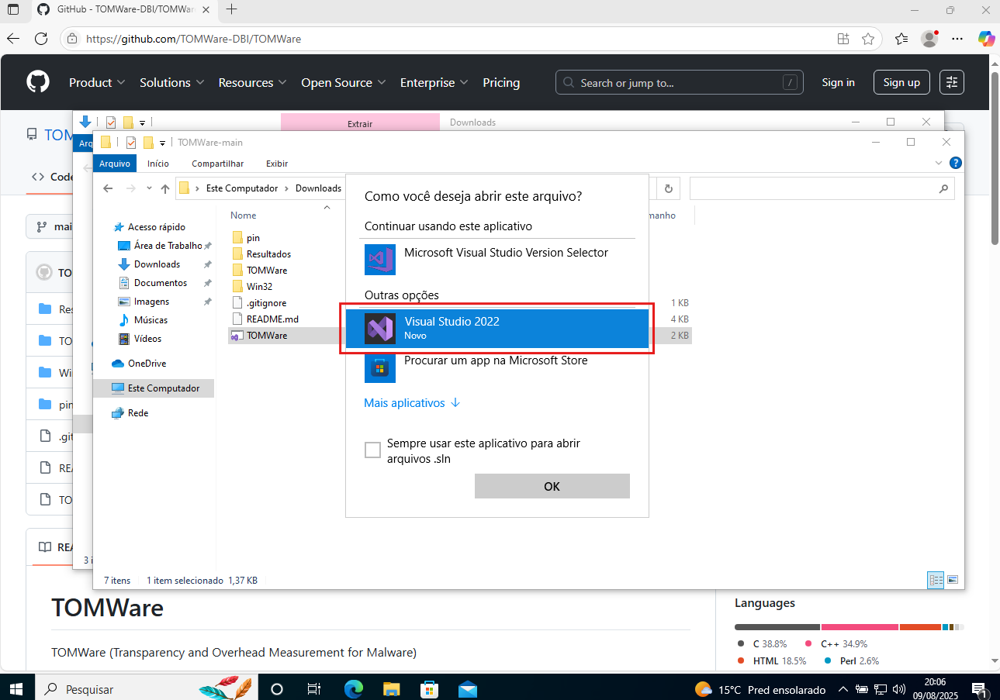

# TOMWare

**Transparency and Overhead Measurement for Malware** — pintool Intel Pin com contramedidas contra técnicas de anti-instrumentação em DBI (Dynamic Binary Instrumentation).

Malware ciente de contexto detecta a presença do Pin por variáveis de ambiente, varredura de memória, medição de overhead, anti-debug e enumeração de processos. A TOMWare mascara esses vetores para permitir análise dinâmica com maior transparência e estabilidade.

---

## Sumário

- [Início rápido](#início-rápido)
- [Contramedidas](#contramedidas)
- [Estrutura do repositório](#estrutura-do-repositório)
- [Dependências e compilação](#dependências-e-compilação)
- [Execução](#execução)
- [Scripts de avaliação](#scripts-de-avaliação)
- [Aplicações de teste (PoC)](#aplicações-de-teste-poc)
- [Selos SBSeg](#selos-sbseg)
- [Dicas e erros comuns](#dicas-e-erros-comuns)

---

## Início rápido

Pré-requisitos: Windows 10/11, Visual Studio 2019 ou 2022 (toolset **v142**), Intel Pin 3.28 x64 (incluído em `pin/`).

```powershell
# 1. Compilar (na raiz do repositório)
& "${env:ProgramFiles}\Microsoft Visual Studio\2022\Community\MSBuild\Current\Bin\MSBuild.exe" `
    TOMWare.sln /p:Configuration=Release /p:Platform=x64

# 2. Teste mínimo — variáveis de ambiente do Pin
.\pin\pin.exe -t .\x64\Release\TOMWare.dll -de -q -- .\Resultados\Apps-Teste\TestGetEnvironments.exe

# 3. Todas as contramedidas em amostra real (recomendado)
.\scripts\run-sample.ps1 -Sample C:\Samples\alvo.exe -DefendAll -Quiet -FollowChild
```

> Use **`Release | x64`** para execuções prolongadas. Mantenha `Debug` apenas para depuração no Visual Studio.

---

## Contramedidas

| Knob | Módulo | O que mitiga |
|------|--------|--------------|
| `-de` | **SanitizePinEnvVars** | Variáveis e artefatos de ambiente do Pin (`PIN_*`, etc.) |
| `-dm` | **InstMemcmpMask** | Varreduras de memória via `memcmp` e padrões configuráveis (`-sf`) |
| `-do` | **SkewMask** | Detecção por medição de overhead/timing (`GetTickCount`, QPC, …) |
| `-dd` | **AntiDebugMask** | APIs anti-debug e flags no PEB (`IsDebuggerPresent`, `NtQueryInformationProcess`, …) |
| `-dp` | **ProcessEnumMask** | Oculta `pin.exe` e módulos Pin em enumeração de processos/módulos |
| `-da` | *(todas acima)* | Ativa `-de`, `-dm`, `-do`, `-dd` e `-dp` (**não** inclui `-go`) |

| Knob auxiliar | Descrição |
|---------------|-----------|
| `-sf PATH` | Assinaturas extras para `-dm` (padrão: `config/signatures.txt`) |
| `-q` | Modo silencioso — suprime logs informativos das contramedidas |
| `-me N` | Limite de exceções antes de abortar (`0` = ilimitado; padrão continua execução) |
| `-go` | Gerador **artificial** de overhead — somente PoCs (`TestOverhead.exe`); use com `-do` |
| `-gdb` | Simula indicadores anti-debug no PEB — somente demonstrações com `-dd` |

**Recomendações**

- Amostras reais: `-da -q` (com `-follow_execv 1` quando houver processos filhos).
- PoC de overhead: `-do -go`.
- Baseline vs contramedida: `scripts\run-baseline-dm-one.cmd`.

---

## Estrutura do repositório

```text
TOMWare/                              ← raiz do repositório (este README)
├── TOMWare/                          ← código-fonte da pintool (.cpp/.h)
├── pin/                              ← Intel Pin 3.28 (x64, MSVC)
├── config/                           ← assinaturas (-sf), corpus DBI-Log, mapeamento TA0005
├── scripts/                          ← execução e benchmark
├── imgs/                             ← capturas de tela deste README
├── Resultados/
│   ├── Apps-Teste/                   ← executáveis das PoCs (pré-compilados)
│   ├── Apps-Teste-src/               ← código-fonte das PoCs (+ TestAntiDebug, TestProcessEnum)
│   ├── Capturas-Tela/                ← capturas dos experimentos do artigo
│   └── Resultados/                   ← resultados publicados (artigo original)
├── TOMWare.sln
└── README.md
```

---

## Dependências e compilação

| Componente | Versão / nota |
|------------|---------------|
| Visual Studio | 2019 ou 2022 — workload *Desktop development with C++* |
| Toolset | **v142** (obrigatório para compatibilidade com Pin) |
| Windows SDK | 10.0.19041 ou superior |
| Intel Pin | 3.28 x64 MSVC — pasta `pin/` |

> Use a distribuição **MSVC** do Pin. A TOMWare **não** foi projetada para o toolchain Clang do Pin.

### Visual Studio

1. Abra `TOMWare.sln`.
2. Se o VS pedir atualização de toolset, escolha **Não** — mantenha **v142**.
3. Selecione **`Release | x64`** (ou `Debug` para depuração).
4. Compile (**Ctrl+Shift+B**).

**Saída esperada:** `x64\Release\TOMWare.dll` (recomendado) ou `x64\Debug\TOMWare.dll`.

<details>
<summary>Capturas de tela — instalação e compilação no VS 2022</summary>

<p align="center">
  
</p>
<p align="center">
  
</p>
<p align="center">
  
</p>
<p align="center">
  
</p>
<p align="center">
  
</p>
<p align="center">
  
</p>
<p align="center">
  
</p>

</details>

### Linha de comando (MSBuild)

```powershell
& "${env:ProgramFiles}\Microsoft Visual Studio\2022\Community\MSBuild\Current\Bin\MSBuild.exe" `
    TOMWare.sln /p:Configuration=Release /p:Platform=x64
```

Ajuste o caminho do MSBuild conforme sua edição do Visual Studio (Community, Professional, Enterprise).

---

## Execução

### Sintaxe geral

```powershell
.\pin\pin.exe -t .\x64\Release\TOMWare.dll [KNOBS] -- <caminho-do-alvo.exe>
```

Exemplo com Pin em outro diretório:

```powershell
<PATH_PIN>\pin.exe -t <PATH_TOMWARE>\TOMWare.dll -da -q -follow_execv 1 -- C:\Samples\alvo.exe
```

### Cenários de experimento

Metodologia: **(1)** baseline sem Pin → **(2)** Pin sem contramedida (detecta) → **(3)** Pin com contramedida (não identifica).

```powershell
# (1) Sem Pin
.\Resultados\Apps-Teste\TestGetEnvironments.exe

# (2) Pin sem contramedida
.\pin\pin.exe -t .\x64\Release\TOMWare.dll -- .\Resultados\Apps-Teste\TestGetEnvironments.exe

# (3) Pin com contramedida
.\pin\pin.exe -t .\x64\Release\TOMWare.dll -dm -q -- .\Resultados\Apps-Teste\TestGetEnvironments.exe

# Medição de tempo
Measure-Command {
    .\pin\pin.exe -t .\x64\Release\TOMWare.dll -dm -q -- .\Resultados\Apps-Teste\TestGetEnvironments.exe
}
```

<details>
<summary>Captura de tela — execução de teste</summary>

<p align="center">
  
</p>

</details>

---

## Scripts de avaliação

| Script | Uso |
|--------|-----|
| `scripts/run-sample.ps1` | Wrapper padronizado para uma amostra (knobs, `-FollowChild`, timeout) |
| `scripts/run-baseline-dm-one.cmd` | Baseline vs uma contramedida na mesma tela |
| `scripts/benchmark-poc.ps1` | Valida PoCs sintéticas após compilar |
| `scripts/benchmark-corpus.ps1` | Corpus real (`<SHA256>.exe` em `-SamplesDir`) |
| `scripts/benchmark-infected.ps1` | Benchmark em ambiente infectado / VM |

```powershell
# PoCs
.\scripts\benchmark-poc.ps1

# Corpus (amostras nomeadas <SHA256>.exe)
.\scripts\benchmark-corpus.ps1 -SamplesDir C:\Samples\MalwareBazaar -FollowChild -TimeoutSeconds 120

# Baseline vs contramedida (SHA256 = prefixo ou hash completo)
.\scripts\run-baseline-dm-one.cmd 36685efc dm
.\scripts\run-baseline-dm-one.cmd 36685efc da show   # apenas exibe comandos, sem executar
```

Resultados de benchmark: `Resultados/Avaliacao/`. Logs do baseline: `Resultados/baseline-<cm>-<hash8>.log`.

---

## Aplicações de teste (PoC)

| Executável | Contramedida | Cenário |
|------------|--------------|---------|
| `TestGetEnvironments.exe` | `-de` | Variáveis de ambiente do Pin |
| `TestMemoryScan.exe` | `-dm` | Varredura de memória (`memcmp`) |
| `TestOverhead.exe` | `-do` (+ `-go` em demo) | Medição de overhead |
| `TestAntiDebug.exe` | `-dd` | APIs anti-debug (compilar de `Apps-Teste-src/`) |
| `TestProcessEnum.exe` | `-dp` | Enumeração de processos/módulos Pin |

```powershell
.\scripts\run-sample.ps1 -Sample .\Resultados\Apps-Teste\TestGetEnvironments.exe -EnvsDefend -Quiet
.\scripts\run-sample.ps1 -Sample .\Resultados\Apps-Teste\TestMemoryScan.exe -MemoryDefend -Quiet
.\scripts\run-sample.ps1 -Sample .\Resultados\Apps-Teste\TestOverhead.exe -OverheadDefend -SimulateOverhead
.\scripts\run-sample.ps1 -Sample .\Resultados\Apps-Teste\TestAntiDebug.exe -DebugDefend -Quiet
.\scripts\run-sample.ps1 -Sample .\Resultados\Apps-Teste\TestProcessEnum.exe -ProcessEnumDefend -Quiet
.\scripts\run-sample.ps1 -Sample .\Resultados\Apps-Teste\TestGetEnvironments.exe -DefendAll -Quiet
```

Versões em loop (1000 repetições): `Resultados/Apps-Teste/Loop_X_1000/`.

---

## Selos SBSeg

Trabalho original: *Mitigando Técnicas de Anti-Instrumentação em DBI: Contramedidas baseadas em Overhead e Transparência* (SBSeg 2025).

Selos considerados na avaliação:

- **Selo D — Artefatos Disponíveis:** código-fonte e amostras de teste no repositório.
- **Selo F — Artefatos Funcionais:** ferramenta executável conforme instruções deste README.

A versão atual estende o trabalho original com contramedidas `-dd`/`-dp`, scripts de benchmark e avaliação em corpus real para submissão SBSeg 2026 (Salão de Ferramentas).

---

## Dicas e erros comuns

| Problema | Solução |
|----------|---------|
| VS sugere atualizar toolset | Mantenha **v142** |
| Caminhos com espaços | Use aspas: `"C:\Program Files\...\pin.exe"` |
| Arquitetura mista (x86/x64) | Alinhe Pin, `TOMWare.dll` e alvo na mesma arquitetura |
| Packers geram muitas exceções | Padrão `-me 0` continua execução; use `-me N` para abortar após N exceções |
| `-da` vs `-go` | `-da` = contramedidas reais; `-go` só em PoCs de overhead |
| `TOMWare.dll` não encontrada | Compile em `Release \| x64` antes de executar os scripts |
| Push GitHub retorna 403 | Use token (PAT) da conta com permissão de escrita no repositório |

---

## Referência

```text
TOMWare — Transparency and Overhead Measurement for Malware
Intel Pin 3.28 · Windows x64 · MSVC v142
```
