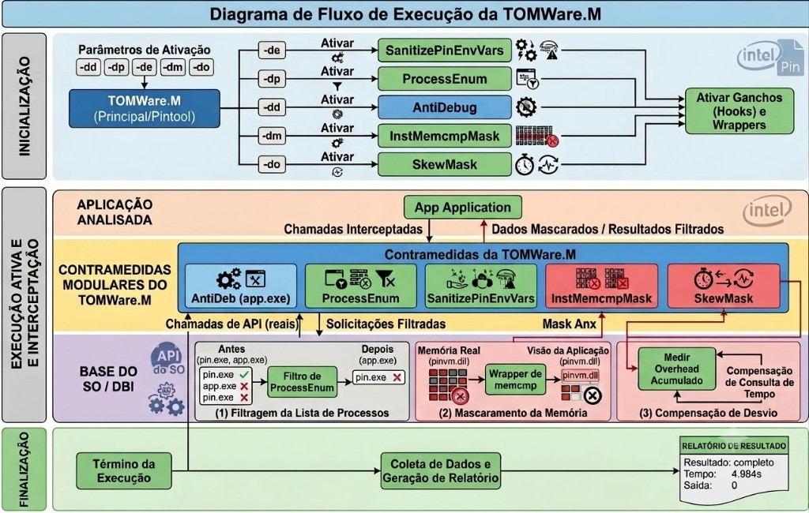
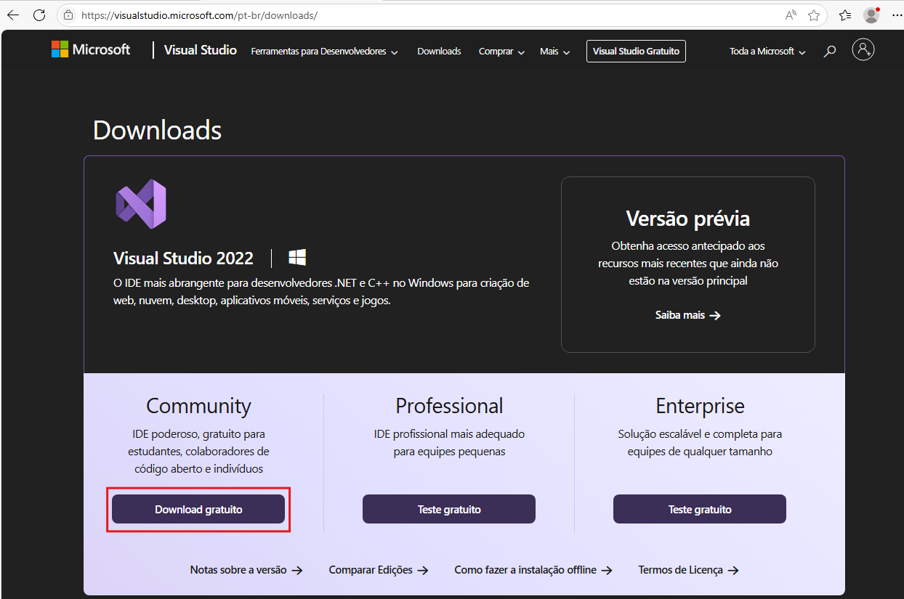
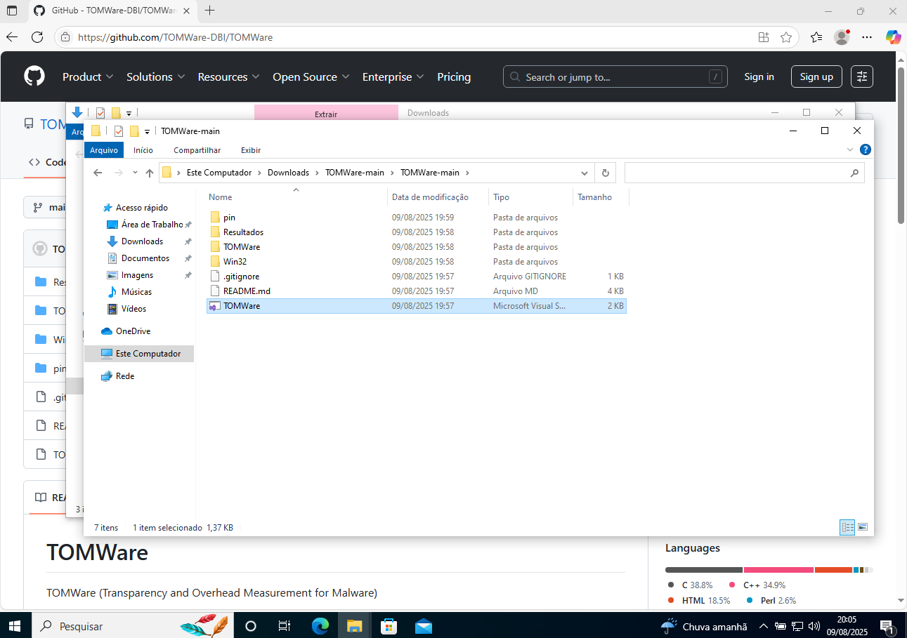

# **TOMWare.M — Mitigação de Técnicas de Anti-Instrumentação em Ambientes DBI**

**TOMWare.M** (*Transparency and Overhead Measurement for Malware*) é uma ferramenta modular de Instrumentação Binária Dinâmica (DBI), desenvolvida sobre o **Intel Pin**, voltada à mitigação de técnicas de anti-instrumentação em executáveis Windows x64.

Repositório: [https://github.com/TOMWare-analises/TOMWare](https://github.com/TOMWare-analises/TOMWare)

---

## Abstract

TOMWare.M is a modular DBI pintool built on Intel Pin to mitigate anti-instrumentation techniques. It implements five selectively activatable countermeasures targeting debugging indicators, process enumeration, environment variables, memory signatures, and execution-time discrepancies. The five modules were validated through controlled test applications; execution times were recorded before and after activation. Results indicate that the countermeasures reduce the corresponding instrumentation indicators in the evaluated scenarios, while temporal impact varies according to the intercepted mechanism and its activation frequency.

**Resumo.** A TOMWare.M implementa cinco contramedidas ativáveis de forma seletiva (`-dd`, `-dp`, `-de`, `-dm`, `-do`), validáveis por aplicações de teste controladas e exercitáveis sobre amostras reais sob Pin. Fornece uma plataforma experimental para investigar a relação entre **transparência** e **impacto temporal** em ambientes DBI.

---

## Table of Contents

* [1. Estrutura deste README](#1-estrutura-deste-readme)
  * [1.1 Organização](#11-organização)
  * [1.2 Artefatos distribuídos](#12-artefatos-distribuídos)
  * [1.3 Estrutura do repositório](#13-estrutura-do-repositório)
  * [1.4 Vídeos de demonstração (playlist)](#14-vídeos-de-demonstração-playlist)
* [2. Selos considerados](#2-selos-considerados)
* [3. Informações básicas](#3-informações-básicas)
  * [3.1 Introdução à execução e experimentos](#31-introdução-à-execução-e-experimentos)
  * [3.2 Principais funcionalidades](#32-principais-funcionalidades)
  * [3.3 Arquitetura](#33-arquitetura)
  * [3.4 Como a execução é estruturada](#34-como-a-execução-é-estruturada)
  * [3.5 Ambiente recomendado](#35-ambiente-recomendado)
* [4. Dependências](#4-dependências)
* [5. Segurança](#5-segurança)
* [6. Instalação](#6-instalação)
* [7. Teste mínimo](#7-teste-mínimo)
* [8. Experimentos](#8-experimentos)
* [9. Licença](#9-licença)

---

# 1. Estrutura deste README

## 1.1 Organização

Este README está organizado nas seguintes seções principais:

1. **Estrutura deste README** — visão geral do documento, repositório e **playlist de vídeos** (§1.4).
2. **Selos considerados** — os quatro selos de artefato do CTA (D / F / S / R).
3. **Informações básicas** — introdução, módulos, arquitetura e ambiente.
4. **Dependências** — requisitos de host, compilação e VM (+ instaladores e amostras no Drive).
5. **Segurança** — isolamento obrigatório ao executar amostras reais.
6. **Instalação** — compilação (opcional) e sintaxe básica da pintool.
7. **Teste mínimo** — validação rápida com apps de teste (sem malware).
8. **Experimentos** — baseline vs contramedida, corpus, medição temporal e evidências (§8.6).
9. **Licença** — termos de uso.

## 1.2 Artefatos distribuídos

* Código-fonte da pintool **TOMWare** (`TOMWare/`).
* Binários de teste pré-compilados (`Resultados/Apps-Teste/`), incluindo variantes `Loop_X_1000/`.
* Fontes das aplicações de teste (`Resultados/Apps-Teste-src/`).
* Intel Pin 3.28 MSVC x64 (`pin/`), quando incluído na distribuição.
* Assinaturas para mascaramento de memória (`config/signatures.txt`).
* Scripts de execução e benchmark (`scripts/`).
* Diagrama de fluxo de execução atual (`imgs/tomware-fluxo-execucao-23072026.png`).
* Capturas e resultados de experimento (`Resultados/`), incluindo evidências consolidadas em `Resultados/evidencias_VM/` — ver §8.6.
* Pacote de instaladores (Git, Visual Studio, 7-Zip, VMware, Pin, TOMWare, ISO) no [Google Drive — Instaladores](https://drive.google.com/drive/folders/18bq-fFzjVcBa1-KuJIoL5KAmS_AHkAtB?usp=sharing) — ver §4.4.
* Corpus de amostras **benignas** e **infectadas** no [Google Drive — malwares](https://drive.google.com/drive/folders/1h9isdbOZhvAJrYbzOn1CKMKEo5TsNzXS?usp=sharing) — ver §4.5.
* Playlist de vídeos (download → instalação → configuração → execução → resultados) na pasta **`demonstracao`** do Drive — ver §1.4.

> O objetivo dos artefatos é permitir: (1) explorar o código; (2) verificar a funcionalidade (teste mínimo); (3) reproduzir os experimentos do artigo (apps de teste + amostras reais sob Pin); (4) avaliar o impacto temporal das contramedidas.

## 1.3 Estrutura do repositório

```text
TOMWare/                              ← raiz do repositório (este README)
├── TOMWare/                          ← código-fonte da pintool (.cpp/.h)
├── pin/                              ← Intel Pin 3.28 (x64, MSVC)
├── config/                           ← assinaturas (-sf), corpus, mapeamentos
├── scripts/                          ← execução e benchmark
│   ├── run-sample.ps1
│   ├── run-baseline-dm-one.ps1/.cmd  ← baseline vs uma contramedida (mesmo print)
│   ├── benchmark-poc.ps1
│   ├── benchmark-corpus.ps1
│   ├── benchmark-infected.ps1
│   └── lib/TomwareBenchmark.ps1
├── imgs/                             ← figuras do README / arquitetura
├── Resultados/
│   ├── Apps-Teste/                   ← executáveis das apps de teste
│   │   └── Loop_X_1000/              ← mesmas apps com 1000 iterações
│   ├── Apps-Teste-src/               ← fontes das apps de teste
│   ├── Capturas-Tela/                ← capturas dos experimentos
│   ├── Avaliacao/                    ← saídas de benchmark (quando geradas)
│   ├── benchmarks/                   ← CSV/JSON por execução (gerados na VM)
│   └── evidencias_VM/                ← evidências publicadas (PDF/CSV/JSON) — §8.6
│       ├── benign/                   ← corpus benigno (por hash + consolidado)
│       ├── malign/                   ← corpus infectado (por hash + consolidado)
│       └── comparativo/              ← benigno vs maligno
├── TOMWare.sln
├── LICENSE
└── README.md
```

> **Importante:** ao baixar o `.zip` do GitHub, a pasta pode chamar-se `TOMWare-main`. Ajuste os caminhos dos exemplos conforme o local de extração.  
> Na VM, as amostras para execução ficam em `C:\TOMWare\malwares\benign\` e `C:\TOMWare\malwares\infected\` (download: §4.5).

## 1.4 Vídeos de demonstração (playlist)

Screencasts com **legendas queimadas** (PT-BR). A playlist é uma **demonstração do fluxo** (download → instalação → configuração → execução de exemplo → coleta), alinhada ao README — **não** pretende cobrir todos os experimentos do §8.

Pasta no Drive: **`demonstracao`** (junto ao [pacote de instaladores](https://drive.google.com/drive/folders/18bq-fFzjVcBa1-KuJIoL5KAmS_AHkAtB?usp=sharing)).

### Sequência (ordem de assistir)

| # | Fase | O que o vídeo mostra | Arquivo | README |
|---|------|----------------------|---------|--------|
| 01 | Download | Git for Windows | `01-download-git.mp4` (+ `.srt`) | §4.4 |
| 02 | Download | Visual Studio Community | `02-download-visual-studio.mp4` (+ `.srt`) | §4.2 / §4.4 |
| 03 | Download | 7-Zip | `03-download-7zip.mp4` (+ `.srt`) | §4.3 / §4.4 |
| 04 | Download | VMware Workstation | `04-download-vmware.mp4` (+ `.srt`) | §3.5 / §4.4 |
| 05 | Download | ISO Windows 10/11 **x64** | `05-download-windows-iso-x64.mp4` (+ `.srt`) | §3.5 / §4.4 |
| 06 | Instalação | Instalar Git | `06-instalacao-git.mp4` | §6.1.1 |
| 07 | Instalação | Instalar Visual Studio (C++ + **v142**) | `07-instalacao-visual-studio.mp4` | §6.1.2 |
| 08 | Instalação | Instalar 7-Zip | `08-instalacao-7zip.mp4` | §4.3 |
| 09 | Instalação | Instalar VMware + criar VM Windows | `09-instalacao-vmware-e-criacao-vm.mp4` | §3.5 / §8.1 |
| 10 | Configuração | Rede da VM desligada (pré-amostras) | `10-config-vm-rede-desligada.mp4` | §5.2 / §8.1 |
| 11 | Configuração | Copiar `pin.7z` + `TOMWare.7z` (Drive → host → VM) | `11-config-copia-pin-tomware-para-vm.mp4` | §4.1 / §8.1 |
| 12 | Execução | Exemplo: amostra **benigna** + contramedida **`-dm`** | `12-execucao-amostra-benigna-dm.mp4` | §5 / §8.1–§8.2 |
| 13 | Resultados | Coleta CSV/JSON em `Resultados\benchmarks\` (+ cópia ao host) | `13-coleta-resultados-benchmark.mp4` | §8.2–§8.3 |

Convenção de nomes: `NN-fase-assunto.mp4` (ordem lexicográfica = ordem de assistir). Itens **01–05** podem ter `.srt` ao lado; **06–13** têm legendas queimadas no MP4.

---

# 2. Selos considerados

Selos do **Comitê Técnico de Artefatos (CTA)** do SBSeg ([orientação oficial](https://doc-artefatos.github.io/sbseg2026/)). Este artefato **concorre aos quatro**:

| Selo | Critério (resumo CTA) | Como este repositório atende |
|------|----------------------|------------------------------|
| **Disponíveis (SeloD)** | Código/dados em repositório estável com README mínimo | GitHub público; este README; [Instaladores](https://drive.google.com/drive/folders/18bq-fFzjVcBa1-KuJIoL5KAmS_AHkAtB?usp=sharing), [malwares](https://drive.google.com/drive/folders/1h9isdbOZhvAJrYbzOn1CKMKEo5TsNzXS?usp=sharing) e playlist no Drive; evidências em `Resultados/evidencias_VM/` |
| **Funcionais (SeloF)** | Artefato executável; deps, ambiente, instalação e exemplo mínimo | §3.5 / §4 (deps e versões), §6 (instalação), §7 (teste mínimo com apps em `Resultados/Apps-Teste/`) |
| **Sustentáveis (SeloS)** | Código modular, legível e mapeável às reivindicações | Estrutura `TOMWare/` + `scripts/`; knobs `-dd/-dp/-de/-dm/-do`; diagrama §3.3; evidências em `Resultados/` |
| **Reproduzíveis (SeloR)** | Reproduzir as principais reivindicações do artigo | §8 (protocolo VM/snapshot, scripts, corpus); evidências em `Resultados/evidencias_VM/` (§8.6); playlist §1.4 como demonstração do fluxo |

Trabalho de base: SBSeg 2025 (TOMWare). Extensão atual (**TOMWare.M**, SBSeg 2026 SF): módulos **AntiDebug** (`-dd`) e **ProcessEnum** (`-dp`).

---

# 3. Informações básicas

## 3.1 Introdução à execução e experimentos

Malware ciente de contexto pode detectar o Intel Pin por: indicadores de depuração, enumeração de processos (`pin.exe`), variáveis de ambiente `PIN_*`, assinaturas em memória e discrepâncias de tempo (overhead). A TOMWare.M mascara essas superfícies para permitir análise dinâmica com maior transparência.

Os experimentos deste repositório têm dois objetivos:

1. **Validar funcionalidade** - demonstrar que cada módulo reduz o indicador correspondente na aplicação de teste (oráculo controlado).
2. **Avaliar impacto** - registrar tempos de execução sob Pin **sem** e **com** a contramedida (campo `Result` / medição de parede), inclusive sobre amostras reais.

> **Ambiente isolado:** experimentos com malware devem ocorrer **somente em VM**, restaurada a partir de snapshot limpo após cada amostra.

> **Binários benignos:** apps de teste e ferramentas legítimas podem rodar no host, sem desativar antivírus, para validar a instalação.

## 3.2 Principais funcionalidades

A arquitetura distingue **módulos** (empacotadores ativados pelos parâmetros da linha de comando) e **contramedidas** (mecanismos que mascaram a superfície de detecção). Os nomes são **distintos**: o módulo é o empacotador; a contramedida é o mecanismo acionado.

```text
Parâmetros (-da -dd -de -dm -do -dp)
        │
        ▼
 Instrumentation ──► Módulos (empacotadores) ──► Contramedidas
                           AntiDeb                    AntiDebug
                           ProcessE                   ProcessEnum
                           SanitizePin                SanitizePinEnvVars
                           InstMem                    InstMemcmpMask
                           SkewM                      SkewMask
```

| Parâmetro | Módulo (empacotador) | Contramedida acionada | Mecanismo (implementação) |
|-----------|----------------------|------------------------|---------------------------|
| `-dd` | **AntiDeb** | **AntiDebug** | PEB: `BeingDebugged`, `NtGlobalFlag` (`AntiDebugMask.cpp`) |
| `-dp` | **ProcessE** | **ProcessEnum** | Filtro em `Process32*` / `Module32*` / `GetModuleHandle*` |
| `-de` | **SanitizePin** | **SanitizePinEnvVars** | Sanitização do bloco de ambiente no PEB (`PIN_*`) |
| `-dm` | **InstMem** | **InstMemcmpMask** | Wrappers `memcmp*` + **Signatures** (`-sf`) |
| `-do` | **SkewM** | **SkewMask** | Hooks temporais + **Calibrate Mask** (Sleep/QPC…) |
| `-da` | *(todos os módulos)* | as cinco contramedidas | Equivale a `-de -dm -do -dd -dp` (**não** inclui `-go`) |

**Knobs auxiliares**

| Knob | Descrição |
|------|-----------|
| `-sf PATH` | Assinaturas extras para o módulo **InstMem** / contramedida **InstMemcmpMask** (padrão: `config/signatures.txt`) |
| `-q` | Modo silencioso (suprime logs informativos) |
| `-me N` | Limite de exceções antes de abortar (`0` = ilimitado) |
| `-go` | Overhead **artificial** - apenas demos com `TestOverhead.exe` (fora de `-da`) |
| `-gdb` | Simula indicadores de debug no PEB - demo de baseline para o módulo **AntiDeb** |

> Os **módulos** são complementares e ativáveis de forma seletiva via **parâmetros**, sem recompilar. Suporte atual: **PE nativo 64-bit** (e builds x86 conforme configuração); sem suporte direto a .NET/Java/scripts.

## 3.3 Arquitetura

<p align="center">
  
</p>

**Leitura do diagrama (fluxo de execução)**

O desenho organiza o ciclo da pintool em três fases, alinhadas a `TOMWare.cpp` / `Instrumentation.cpp` e aos fontes das contramedidas:

1. **Inicialização** — `PIN_Init` + `InitInstrumentation()` lê os **parâmetros** (`-dd`, `-dp`, `-de`, `-dm`, `-do`; `-da` ativa todos) e liga os **módulos/contramedidas** correspondentes; em seguida **ativa ganchos e wrappers** (`IMG_AddInstrumentFunction`, RTN replace, callbacks de imagem).
2. **Execução ativa e interceptação** — a **aplicação analisada** realiza chamadas; a faixa central de **contramedidas modulares** devolve dados mascarados/filtrados; por baixo, a base SO/DBI concretiza, entre outros:
   - **(1) Filtragem da lista de processos** — **ProcessEnum** oculta `pin.exe` / artefatos Pin em `Process32*` / `Module32*` / `GetModuleHandle*`.
   - **(2) Mascaramento da memória** — **InstMemcmpMask** (wrappers `memcmp*` + **Signatures** `-sf`) evita hits em strings/módulos Pin.
   - **(3) Compensação de desvio** — **SkewMask** mede overhead acumulado e compensa consultas temporais (Sleep/QPC…).
   - Em paralelo (não detalhados nos painéis 1–3 do desenho, mas ativos quando ligados): **AntiDebug** e **SanitizePinEnvVars** atuam sobretudo no **PEB** (`BeingDebugged` / `NtGlobalFlag`; variáveis `PIN_*`).
3. **Finalização** — término da execução sob Pin; **coleta de dados e relatório** (`Result`: outcome, tempo, saída) são produzidos pelo **harness de avaliação** (`scripts/run-baseline-dm-one.ps1` e afins), não por um gerador embutido na DLL.

| Parâmetro | Contramedida no fluxo | Implementação |
|-----------|----------------------|---------------|
| `-de` | SanitizePinEnvVars | `SanitizePinEnvVars.cpp` |
| `-dp` | ProcessEnum | `ProcessEnumMask.cpp` |
| `-dd` | AntiDebug | `AntiDebugMask.cpp` |
| `-dm` | InstMemcmpMask | InstMemcmp* + `config/signatures.txt` |
| `-do` | SkewMask | `SkewMask.cpp` (calibração temporal) |
| `-da` | todas as cinco | equivalente a `-de -dm -do -dd -dp` |

| Componente | Função | Onde |
|------------|--------|------|
| **Main / TOMWare.M** | `PIN_Init` → inicia a instrumentação | `TOMWare/TOMWare.cpp` |
| **Instrumentation** | Interpreta parâmetros e registra hooks | `TOMWare/Instrumentation.cpp` |
| **Contramedidas** | Mascaramento seletivo por superfície | fontes acima |
| **Apps de teste** | Oráculos funcionais (evidência no console) | `Resultados/Apps-Teste/` |
| **Harness** | Relatório `Result` / CSV / JSON do experimento | `scripts/` |

**Coerência com o código (verificado):** mapeamento parâmetro→init confere com `InitInstrumentation()`; ProcessEnum / InstMemcmpMask / SkewMask batem com os painéis (1)–(3); AntiDebug e SanitizePinEnvVars existem e são ativados por `-dd`/`-de`, embora o desenho os destaque mais na inicialização do que nos painéis inferiores. O bloco **Relatório de Resultado** corresponde ao protocolo de benchmark (§3.4 / §8), não a um módulo interno da pintool.

Diagrama Mermaid equivalente (fluxo): `imgs/tomware-architecture-current.mmd`.  
Figura estrutural anterior (módulos → contramedidas): `imgs/tomware_pintool_20072026.png`.  
Variante anotada (PEB / Signatures / Calibrate): `imgs/tomware-architecture-annotated.png`.

## 3.4 Como a execução é estruturada

Cada execução de experimento segue **duas etapas**:

| Etapa | Alvo | Objetivo |
|-------|------|----------|
| **[1] App de teste** | `TestAntiDebug.exe`, `TestProcessEnum.exe`, … | Evidência funcional no console (caixa `Resumo` / alertas) |
| **[2] Amostra real** | `malwares\infected\<SHA256>.exe` | Exercitar a amostra sob Pin ± contramedida; tempo no campo `Result` |

Protocolo de comparação:

1. **Nativo** (referência comportamental, sem Pin).
2. **Pin + TOMWare sem a contramedida** (baseline - indicador aparece).
3. **Pin + TOMWare com a contramedida** (indicador mascarado).

Script recomendado para o print lado a lado:

```powershell
.\scripts\run-baseline-dm-one.cmd <SHA256> <de|dm|do|dd|dp|da>
```

> **Nota (ProcessEnum / tempos):** a eficácia da contramedida **ProcessEnum** (módulo **ProcessE**, `-dp`) é evidenciada pela caixa do app de teste (`pin.exe : N → 0`). Se a amostra real atingir `outcome=timeout`, o wall-clock **não** deve ser tratado como métrica de eficácia dessa contramedida.

## 3.5 Ambiente recomendado

| Camada | Especificação sugerida |
|--------|------------------------|
| **Host** | CPU com VT-x/AMD-V; RAM ≥ 16 GB; SSD |
| **Hipervisor** | VMware Workstation / VirtualBox 7.x |
| **VM (guest)** | Windows 10/11 x64; ≥ 4 vCPU; 6–8 GB RAM; rede Host-only ou desligada durante malware |
| **Snapshot** | Restaurar snapshot limpo **após cada amostra** |

> Para apenas validar a instalação, use o teste mínimo (§7) no host com as apps de teste - **sem** malware.

---

# 4. Dependências

## 4.1 Execução

* **Intel Pin** 3.28 (x64, MSVC): [download oficial](https://software.intel.com/sites/landingpage/pintool/downloads/pin-3.28-98749-g6643ecee5-msvc-windows.zip) - pasta `pin/` do repositório (quando fornecida) ou instalação local.
* **TOMWare.dll** - `x64\Release\TOMWare.dll` após compilação.

## 4.2 Compilação (host Windows)

| Ferramenta | Versão / nota |
|------------|---------------|
| Visual Studio 2019 ou 2022 | Workload *Desktop development with C++* |
| Toolset | **v142** (obrigatório, inclusive no VS 2022) |
| Windows 10 SDK | ≥ 10.0.19041 |
| Intel Pin | 3.28 x64 **MSVC** (não Clang) |

## 4.3 VM

| Ferramenta | Uso |
|------------|-----|
| VMware / VirtualBox | Isolamento e snapshots |
| 7-Zip (opcional) | Extração de amostras protegidas |

## 4.4 Pacote de instaladores (Google Drive)

Para facilitar a reprodução, os instaladores das ferramentas de ambiente estão reunidos na pasta compartilhada:

**[Instaladores TOMWare (Google Drive)](https://drive.google.com/drive/folders/18bq-fFzjVcBa1-KuJIoL5KAmS_AHkAtB?usp=sharing)**

O Drive é um **espelho** dos sites oficiais (Git, Microsoft, 7-Zip, Broadcom/VMware, Intel Pin). Prefira as páginas oficiais quando possível; use o Drive para montar o ambiente mais rápido.

### Conteúdo da pasta `Instaladores`

| # | Arquivo (Drive) | O que é | Onde usar | Observação |
|---|-----------------|---------|-----------|------------|
| 1 | `7z2602-x64.exe` | 7-Zip (x64) | **Host** e **VM** | Extrai `.7z` / `.zip` (`pin.7z`, `TOMWare.7z`, amostras) |
| 2 | `Git-*-64-bit.exe` | Git for Windows | **Host** (e VM se for clonar) | Necessário para `git clone` do repositório |
| 3 | `VisualStudioSetup.exe` | Visual Studio Installer | **Host** (compilação) | Workload C++ + toolset **v142** (§4.2 / §6.1) |
| 4 | `VMware-Workstation-Full-*.exe` | VMware Workstation | **Host** | Hipervisor para a VM de experimentos (§3.5) |
| 5 | `Windows.iso` | ISO Windows **x64** | **Host** → criar VM | **Usar esta** para Pin/TOMWare.M (Intel/AMD) |
| 6 | `MediaCreationTool_22H2.exe` | Media Creation Tool (Win 10 22H2) | **Host** (opcional) | Alternativa oficial para baixar/gerar ISO x64 |
| 7 | `Win11_25H2_*_Arm64.iso` | ISO Windows 11 **Arm64** | — | **Não usar** com Pin 3.28 MSVC x64 / TOMWare.M |
| 8 | `pin.7z` | Intel Pin 3.28 (MSVC x64) | Extrair na VM (ou host) em `C:\TOMWare\pin\` | Deve conter `pin.exe`, `intel64\`, etc. |
| 9 | `TOMWare.7z` | Código / artefato TOMWare | Extrair na VM em `C:\TOMWare\` | Inclui scripts, `TOMWare.dll` (se pré-build), apps de teste |
| 10 | `TOMware_pin_samples_benign.7z` | (Opcional) pacote compactado de benignas | Extrair na VM em `malwares\benign\` | Preferir o corpus completo no Drive **malwares** (§4.5) |

> **Arm64:** a ISO `Win11_*_Arm64.iso` serve só a máquinas ARM. Para os experimentos deste README, a VM deve ser **Windows 10/11 x64**. Use `Windows.iso` (ou ISO x64 gerada pelo Media Creation Tool).

### Sequência correta de instalação

Ordem alinhada à playlist (§1.4) e ao fluxo host → VM:

| Passo | Onde | Ação | Arquivo(s) |
|------:|------|------|------------|
| 1 | Host | Instalar **7-Zip** | `7z2602-x64.exe` |
| 2 | Host | Instalar **Git** | `Git-*-64-bit.exe` |
| 3 | Host | Instalar **Visual Studio** (C++ + **v142**) | `VisualStudioSetup.exe` |
| 4 | Host | Instalar **VMware Workstation** | `VMware-Workstation-Full-*.exe` |
| 5 | Host | Criar VM com ISO **x64** (não Arm64) | `Windows.iso` (ou MCT → ISO x64) |
| 6 | VM | (Opcional) instalar 7-Zip / Git na guest | mesmos `.exe` |
| 7 | VM | Extrair **Pin** em `C:\TOMWare\pin\` | `pin.7z` |
| 8 | VM | Extrair **TOMWare** em `C:\TOMWare\` | `TOMWare.7z` |
| 9 | VM | Baixar e colocar amostras | Drive **malwares** (§4.5) → `malwares\benign\` e `malwares\infected\` |
| 10 | VM | Antes de rodar amostras: rede / Internet / AV / firewall **desligados** | — (§5 / §8.1) |

Compilação da pintool (se `x64\Release\TOMWare.dll` ainda não vier no pacote): §6.1 no **host** ou na VM com VS instalado.

Vídeos: download/instalação dos itens 1–5 → playlist §1.4 (01–09); cópia Pin/TOMWare → item **11**; execução benigna → **12**; coleta → **13**.

## 4.5 Amostras para experimentos (Google Drive)

As amostras usadas nos testes (benignas e infectadas) estão na pasta compartilhada:

**[malwares — benign / infected (Google Drive)](https://drive.google.com/drive/folders/1h9isdbOZhvAJrYbzOn1CKMKEo5TsNzXS?usp=sharing)**

| Subpasta no Drive | Destino na VM | Uso |
|-------------------|---------------|-----|
| `benign/` | `C:\TOMWare\malwares\benign\<SHA256>.exe` | Corpus benigno (`-SampleType benign`) |
| `infected/` | `C:\TOMWare\malwares\infected\<SHA256>.exe` | Corpus infectado (padrão do script) |

> **Segurança:** baixe e execute amostras infectadas **somente na VM**, com rede/AV/firewall desligados (§5). Não execute no host.

---

# 5. Segurança

A TOMWare.M **não contém código malicioso** - é uma pintool C/C++ que mascara vestígios do Pin. **O risco vem das amostras reais** usadas nos experimentos.

## 5.1 Vetores de risco

| Vetor | Descrição |
|-------|-----------|
| Execução de amostra | Escape da VM pode infectar o host |
| Rede | Download de payloads / exfiltração |
| Pastas compartilhadas / clipboard | Canal de fuga para o host |

## 5.2 Medidas obrigatórias

1. Não execute amostras reais no host.
2. VM dedicada, rede desligada ou Host-only durante a execução.
3. Snapshot limpo; restaurar após cada amostra.
4. Desative pastas compartilhadas/clipboard enquanto o malware roda; habilite só para copiar logs **antes** de restaurar.
5. Apps de teste em `Resultados/Apps-Teste/` são benignas e podem rodar no host.

## 5.3 Aviso legal

As amostras e instruções destinam-se a **fins acadêmicos**. Os autores não se responsabilizam por danos decorrentes de uso inadequado ou fora de ambiente controlado.

---

# 6. Instalação

## 6.1 Compilação (opcional, se `TOMWare.dll` ainda não existir)

### 6.1.1 Obter o código

```powershell
git clone https://github.com/TOMWare-analises/TOMWare.git
cd TOMWare
```

### 6.1.2 Dependências

1. Visual Studio com toolset **v142**.
2. Windows SDK ≥ 10.0.19041.
3. Pin 3.28 MSVC extraído em `pin\` (conteúdo direto: `pin.exe`, `intel64\`, etc.).

Os instaladores (Git, VS, 7-Zip, VMware, Pin, TOMWare) também estão no [Google Drive TOMWare](https://drive.google.com/drive/folders/18bq-fFzjVcBa1-KuJIoL5KAmS_AHkAtB?usp=sharing) — ver §4.4.

### 6.1.3 Compilar

1. Abra `TOMWare.sln`.
2. Se o VS pedir upgrade de toolset → **Não** (mantenha v142).
3. Configuração **`Release | x64`**.
4. Build (**Ctrl+Shift+B**).

Saída esperada:

```text
x64\Release\TOMWare.dll
```

<details>
<summary>Capturas — compilação no VS 2022</summary>

<p align="center"></p>
<p align="center"></p>
<p align="center"></p>
<p align="center"></p>
<p align="center"></p>
<p align="center"></p>

</details>

**MSBuild (linha de comando):**

```powershell
& "${env:ProgramFiles}\Microsoft Visual Studio\2022\Community\MSBuild\Current\Bin\MSBuild.exe" `
    TOMWare.sln /p:Configuration=Release /p:Platform=x64
```

## 6.2 Execução

### 6.2.1 Sintaxe básica

```powershell
.\pin\pin.exe -t .\x64\Release\TOMWare.dll [KNOBS] -- <alvo.exe>
```

Exemplos:

```powershell
# AntiDebug
.\pin\pin.exe -t .\x64\Release\TOMWare.dll -dd -q -- .\Resultados\Apps-Teste\TestAntiDebug.exe

# ProcessEnum
.\pin\pin.exe -t .\x64\Release\TOMWare.dll -dp -q -- .\Resultados\Apps-Teste\TestProcessEnum.exe

# Todas as contramedidas + follow child (amostra real)
.\scripts\run-sample.ps1 -Sample C:\TOMWare\malwares\infected\<SHA256>.exe -DefendAll -Quiet -FollowChild
```

---

# 7. Teste mínimo

Valida a instalação **sem malware**, usando apps de teste no host.

## 7.1 Pré-requisitos

* Windows 10/11 x64
* `pin\` e `x64\Release\TOMWare.dll`
* `Resultados\Apps-Teste\TestGetEnvironments.exe` (ou outro app da tabela)

## 7.2 Passo a passo

```powershell
cd C:\caminho\para\TOMWare

# (1) Sem Pin — referência
.\Resultados\Apps-Teste\TestGetEnvironments.exe

# (2) Pin sem contramedida — deve alertar / detectar vestígios
.\pin\pin.exe -t .\x64\Release\TOMWare.dll -q -- .\Resultados\Apps-Teste\TestGetEnvironments.exe

# (3) Pin com contramedida — indicador mascarado
.\pin\pin.exe -t .\x64\Release\TOMWare.dll -de -q -- .\Resultados\Apps-Teste\TestGetEnvironments.exe
```

| App de teste | Knob |
|--------------|------|
| `TestGetEnvironments.exe` | `-de` |
| `TestMemoryScan.exe` | `-dm` |
| `TestOverhead.exe` | `-do` (+ `-go` em demo) |
| `TestAntiDebug.exe` | `-dd` |
| `TestProcessEnum.exe` | `-dp` |

Via wrapper:

```powershell
.\scripts\run-sample.ps1 -Sample .\Resultados\Apps-Teste\TestProcessEnum.exe -ProcessEnumDefend -Quiet
.\scripts\run-sample.ps1 -Sample .\Resultados\Apps-Teste\TestAntiDebug.exe -DebugDefend -Quiet
```

---

# 8. Experimentos

## 8.1 Preparar a VM

1. Criar VM Windows 10/11 x64 (snapshot limpo).
2. Copiar o repositório (ou artefatos) para `C:\TOMWare`.
3. Compilar ou copiar `x64\Release\TOMWare.dll`.
4. Baixar as amostras do [Drive malwares](https://drive.google.com/drive/folders/1h9isdbOZhvAJrYbzOn1CKMKEo5TsNzXS?usp=sharing) e colocar em:
   - `C:\TOMWare\malwares\benign\<SHA256>.exe`
   - `C:\TOMWare\malwares\infected\<SHA256>.exe`
5. Desligar rede / Host-only; desativar AV e firewall se o protocolo do artigo exigir.

Demonstração em vídeo: §1.4 itens **10–12** (rede off → cópia Pin/TOMWare → execução benigna `-dm`).

## 8.2 Reproduzir comparação baseline vs contramedida

```powershell
# Preferir linha única (evitar "^" no CMD — evita prompt "Mais?")
powershell.exe -NoProfile -ExecutionPolicy Bypass -File "C:\TOMWare\scripts\run-baseline-dm-one.ps1" `
  -Sha256 "36685efcf34c7a7a6f6dd2e48199e4700b5ab8fe3945a50297703dd8daced74f" `
  -Countermeasure dd

# Outros módulos
.\scripts\run-baseline-dm-one.cmd a0aeb837 dp
.\scripts\run-baseline-dm-one.cmd 17c79863 dm
.\scripts\run-baseline-dm-one.cmd 36685efc da -Loop1000

# Amostra benigna: 10 execuções independentes para cada contramedida
.\scripts\run-baseline-dm-one.ps1 `
  -Sha256 "4D6937E8D7D58CD1D9224A11E48549A08505836EFABD6FED17A67D42466265BB" `
  -SampleType benign -AllCountermeasures
```

O script imprime, no mesmo console:

* caminho da amostra (hash);
* comando Pin do app de teste;
* caixa de evidência (baseline vs `-xx`);
* linha `Result` da amostra real.

## 8.3 Corpus / benchmark

```powershell
.\scripts\benchmark-poc.ps1
.\scripts\benchmark-corpus.ps1 -SamplesDir C:\TOMWare\malwares\infected -FollowChild -TimeoutSeconds 120
```

Saídas típicas: `Resultados\Avaliacao\`, `Resultados\baseline-<cm>-<hash8>.log`.

Com `-Repeat N`, cada baseline e contramedida é iniciado como um processo
independente. A ordem é alternada por rodada para reduzir viés de aquecimento.
Os relatórios detalhados são gravados em:

* `Resultados\benchmarks\benchmark-<tipo>-<cm>-<hash8>-<data>.csv` — uma linha por execução,
  incluindo status, resposta e resumo da evidência funcional;
* `Resultados\benchmarks\benchmark-<tipo>-<cm>-<hash8>-<data>.json` — execuções, evidência
  funcional completa e avaliação de desempenho com média, mediana, p95, desvio-padrão,
  mínimo, máximo e contagem de outcomes;
* `Resultados\benchmarks\benchmark-<tipo>-all-<hash8>-<data>.csv|json` — consolidação
  automática das cinco contramedidas ao usar `-AllCountermeasures`.

`-AllCountermeasures` executa sequencialmente `de`, `dm`, `do`, `dd` e `dp`.
Não inclui `da`, pois `da` mede todas as proteções habilitadas simultaneamente,
e não cada contramedida isolada.

Cada relatório responde separadamente:

* **Funcional:** “A contramedida ocultou o Pin?” (`PASS`, `FAIL` ou `INCONCLUSIVE`);
* **Desempenho:** “Qual foi o impacto no desempenho?” (`VALID` ou `INCONCLUSIVE`).

Um resultado funcional pode ser `PASS` mesmo quando o desempenho é inconclusivo:
as duas conclusões usam evidências diferentes.

Por padrão, cada amostra recebe uma janela de observação de 10 segundos
(`-SampleObservationSeconds 10`). Aplicações que encerram naturalmente mantêm
o outcome `complete`; aplicações gráficas ou persistentes são encerradas ao fim
da janela e recebem outcome `observed`. Durante a janela, o benchmark coleta
CPU acumulada, utilização equivalente de um núcleo, memória de trabalho média/pico
e pico de memória privada do Pin e da amostra. Assim, aplicações persistentes
podem ter uma comparação pareada válida de **recursos**, mesmo quando a comparação
de tempo total é inválida porque a duração foi limitada artificialmente.

Essas métricas representam inicialização mais o estado observado durante a janela.
Elas não medem a latência de uma operação específica da interface gráfica; para
isso, seria necessário automatizar a mesma ação em cada rodada.

## 8.4 Medição de tempo (apps em loop)

```powershell
Measure-Command {
  .\pin\pin.exe -t .\x64\Release\TOMWare.dll -dm -q -- `
    .\Resultados\Apps-Teste\Loop_X_1000\TestMemoryScan.exe
}
```

## 8.5 Interpretação rápida dos resultados

| Observação | Interpretação |
|------------|---------------|
| Baseline: alerta / contagem > 0; com knob: `OK` / zeros | Contramedida **funcional** na superfície testada |
| `Result … outcome=complete` | Tempo da amostra pode entrar na comparação quantitativa |
| `Result … outcome=timeout` | Amostra não terminou no limite — **não** use como tempo válido de eficácia (comum em `-dp`) |

## 8.6 Evidências dos resultados (publicadas)

Além dos CSV/JSON gerados na VM em `Resultados\benchmarks\` (§8.3 / vídeo 13), o repositório publica evidências consolidadas das execuções em:

```text
Resultados/evidencias_VM/
├── benign/          ← por amostra (hash) + consolidado do corpus benigno
├── malign/          ← por amostra (hash) + consolidado do corpus infectado
└── comparativo/     ← comparação benigno vs maligno
```

| Conteúdo | Onde |
|----------|------|
| Relatório por amostra (PDF) | `evidencias_VM/benign/<SHA256>/` e `evidencias_VM/malign/<SHA256>/` |
| Consolidado benigno (17 amostras) | `evidencias_VM/benign/TOMWare-corpus-benigno-17-amostras.pdf` (+ CSV/JSON) |
| Consolidado infectado (14 amostras) | `evidencias_VM/malign/TOMWare-corpus-maligno-14-amostras.pdf` (+ CSV/JSON) |
| Comparativo benigno × maligno | `evidencias_VM/comparativo/TOMWare-comparativo-benigno-vs-maligno.pdf` (+ CSV) |
| Saídas brutas de uma execução local | `Resultados\benchmarks\benchmark-<tipo>-<cm>-<hash8>-<data>.{csv,json}` |

Amostras usadas nesses experimentos: download no [Drive malwares](https://drive.google.com/drive/folders/1h9isdbOZhvAJrYbzOn1CKMKEo5TsNzXS?usp=sharing) (§4.5).

---

# 9. Licença

Este projeto é distribuído para fins acadêmicos e de pesquisa. Consulte o arquivo [`LICENSE`](LICENSE) na raiz do repositório.

**Intel Pin** possui licença própria (veja `pin/licensing/`).

**Citação sugerida (TOMWare.M / SBSeg 2026 SF):**

```text
TOMWare.M: Uma Ferramenta para Mitigação de Técnicas de Anti-Instrumentação
em Ambientes DBI — Salão de Ferramentas, SBSeg 2026.
https://github.com/TOMWare-analises/TOMWare
```

---

## Referência rápida

```text
TOMWare.M — Transparency and Overhead Measurement for Malware
Intel Pin 3.28 · Windows x64 · MSVC v142
Knobs: -dd -dp -de -dm -do | -da | -sf -q -go -gdb -me
```
